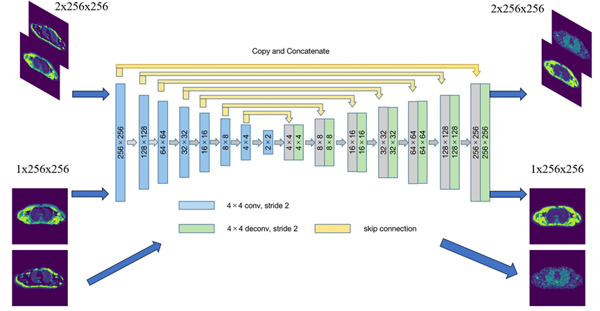
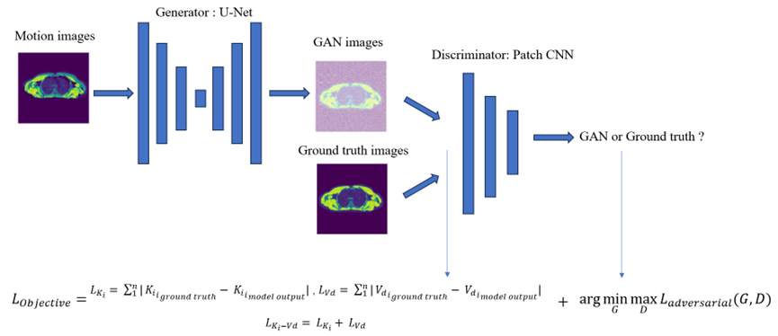
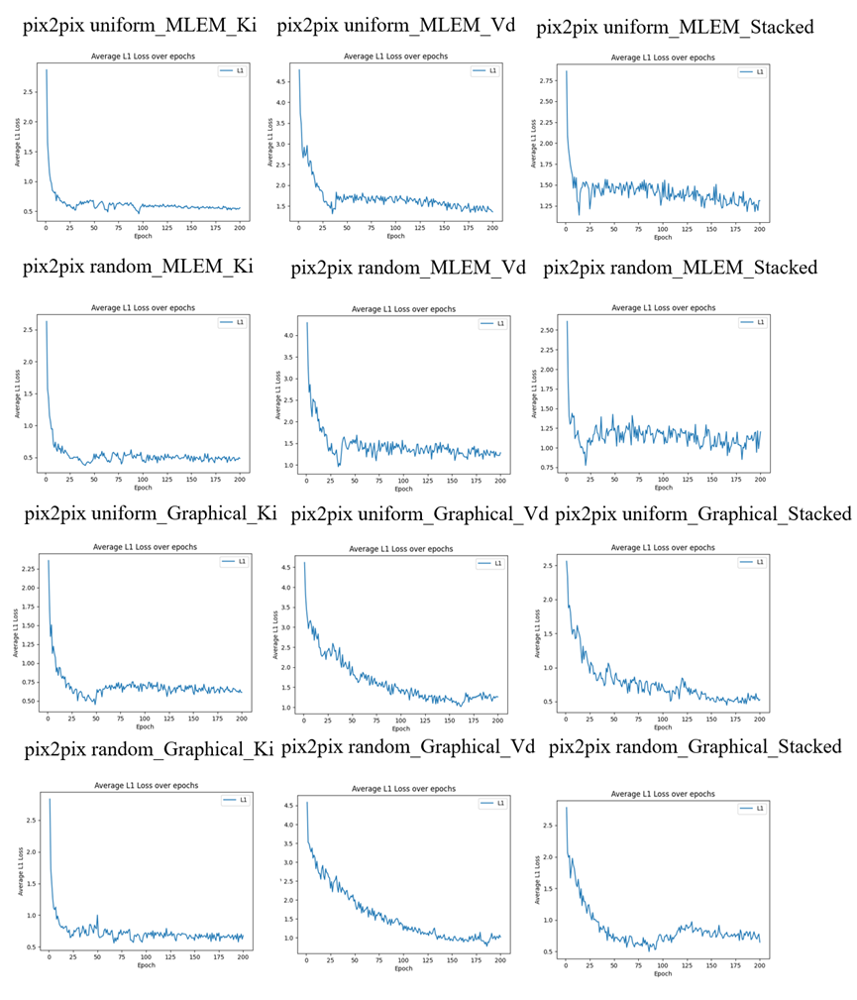
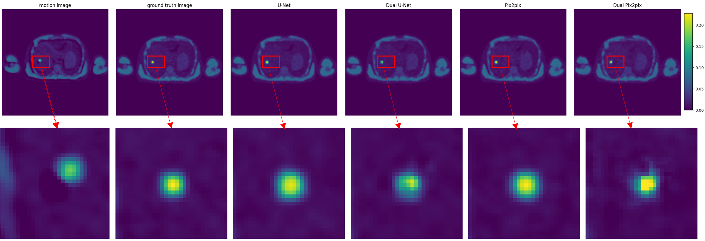
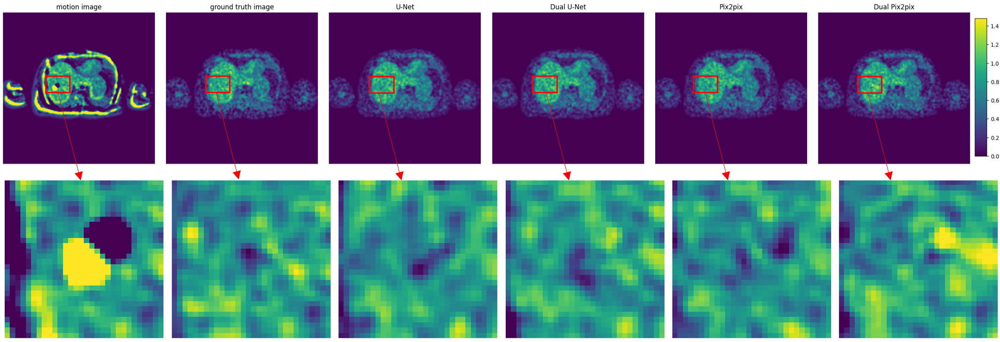

# Using-Deep-Learning-to-correct-parametric-images-for-motion-in-dynamic-PET

## Introduction
This project aims to develop deep learning models to correct motion artifacts for parametric images in dynamic Positron Emission Tomography (PET).

The codes are mainly separated in two parts.
 1. MATLAB code for data simulation and python code for model architectures.
 
  a. data_simulation: Simulate dynamic PET parametric images for training. You can run SimE_uniform.m SimG_uniform.m in MATLAB for generating uniform training sets where E represents MLEM and G represents graphical analysis. Alternatively, you can choose to run SimE_random.m and SimG_random.m for generating random slices parametric images. The parameters in these MATLAB files could be easily modified according to your needs.

  b. data_preprocessing: We provide data_preprocessing packages for you to preprocess the hdf5 data simulated in MATLAB. This package is used in training code and testing code which shown in e. and f.. The purpose of this package is to transform the data either in one channel or two channels tensors which could be accepted by models.

  c. models: models package contains necessary model architectures for U-Net and Pix2pix.

  d. options: options package provide different kinds of experiment setup (parameters and model initialization) which could be easily specified by users either in terminal or in jupyter notebook.

2. Jupyter notebook and some python codes for conduct experiments on training, testing and evaluation for different models.

  e. train: contains different models' training codes.

  f. test: contains different models' testing codes.

  g. TrainTestEvaluation_...ipynb : contains all the training procedure and testing/evaluation procedure. 

  h. evaluation_metrics, evaluation_ROI: used for evaluate for model performances and for visualisation on final ROI results.

  i. Experiments: Procedure on evaluation.

## Prerequisites
- Linux or Windows
- Python 3 / MATLAB 
- CPU or NVIDIA GPU + CUDA CuDNN

## Getting started
### Installation

- Clone this repo:
```bash
git clone https://github.com/williamuic/Using-Deep-Learning-to-correct-parametric-images-for-motion-in-dynamic-PET

cd Using-Deep-Learning-to-correct-parametric-images-for-motion-in-dynamic-PET
```

Type the command `pip install -r requirements.txt` to install required packages for conducting the experiments.
### Conducting experiments

- Data preparation: You can either simulate data by yourself following a. or you can directly download datasets from

``` 
https://drive.google.com/drive/folders/12d8UsIb8RRt5f8VhOvt2H8HntekB5246?usp=drive_link
```
- Model training, testing and evaluation

Follow the procedures in g. or you can copy those commands shown in g. in Linux terminal to conduct experiments.

- Visualise data and results

data_visualisation_crop.ipynb is for visualising your simulated data and its corresponding motion parameters.

Experiments.ipynb is for visualising ROI for parametric images.

- For obtaining pretrained models, training loss and tests results, you can download in following links:

Uniform dataset with MLEM simulation method:

``` 
https://drive.google.com/drive/folders/1bCI1nBRJnNkjwX0M5mprLLRiiHHw2DoQ?usp=drive_link
```
Uniform dataset with Graphical analysis simulation method:

``` 
https://drive.google.com/drive/folders/1ZIGXqaVCo7WOCASuQzG0pHfcQlWQcqB2?usp=drive_link
```
Random dataset with MLEM simulation method:

```
https://drive.google.com/drive/folders/1ZVHwDOQ3HmAFewWlHMfBpCmcPsC6OEs1?usp=drive_link
```

Random dataset with Graphical analysis simulation method:

```
https://drive.google.com/drive/folders/1de0Nv2BC9ftEAQN97vTstWVjxI1-1S1T?usp=drive_link
```
## Model architecture used in my paper
### U-Net/Dual U-Net

### Pix2pix/Dual Pix2pix


## Different experiments' loss 



## Example of motion correction results compared with groud truth (liver leision images)





